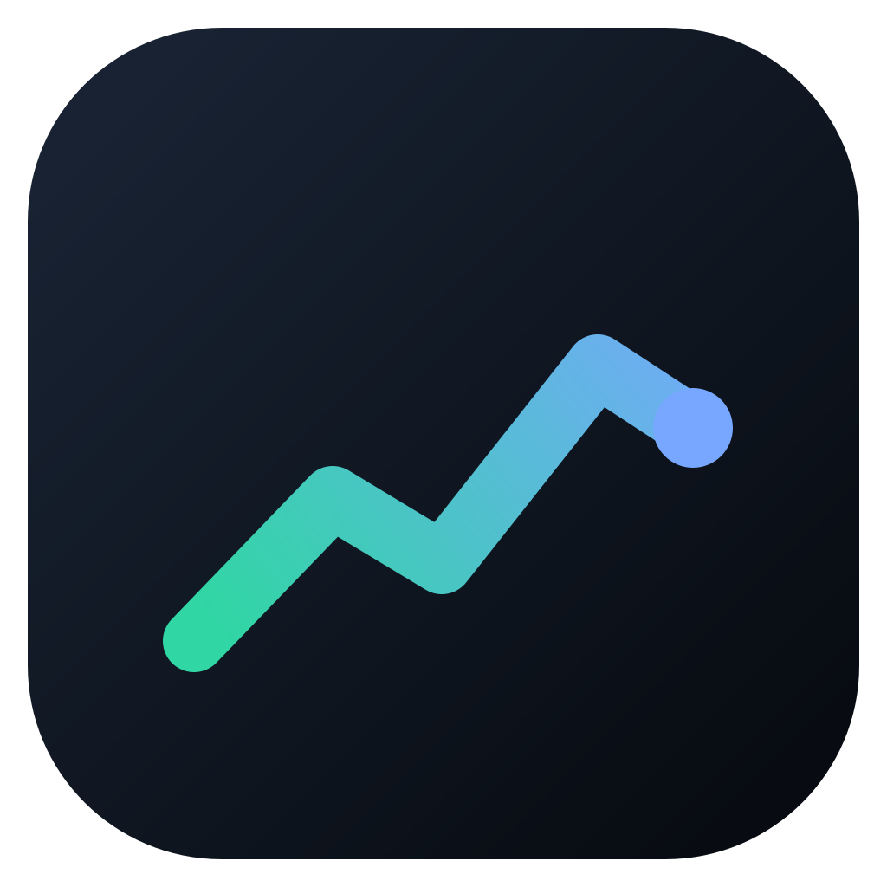

<p align="center">
  
</p>

<h1 align="center">Better Charts</h1>

<p align="center">A desktop trading interface for MetaTrader 5.</p>

<p align="center">
  <a href="#features">Features</a> ·
  <a href="#build">Build</a> ·
  <a href="#connect-to-metatrader-5">Connect to MT5</a> ·
  <a href="#try-without-mt5">Try without MT5</a> ·
  <a href="#development">Development</a> ·
  <a href="#license">License</a>
</p>

A desktop trading interface for MetaTrader 5, built with React, TypeScript,
Lightweight Charts and Tauri/Rust. A local Expert Advisor supplies market and
account data and executes trading commands. MT5 and a broker account are
required and are not bundled.

## Features

- Live candlestick charts, Bid/Ask quotes, symbol search and six timeframes.
- Fixed Range Volume Profile with BID/ASK tick activity and POC/VAH/VAL.
- Market, Limit, Stop and Stop Limit orders, risk sizing, SL/TP and OrderCheck.
- Chart and portfolio controls for modifying, closing and cancelling orders;
  chart controls can remove live SL/TP from positions and pending orders.
- Account/session binding, reconciliation and durable execution journals.
  Commands are never retried automatically.

This is an early release tested with a demo account. Real-money trading has
not been validated. Some chart gestures submit modifications directly when
trading is enabled. Start with a demo account. Partial close, Break Even,
multiple charts and Pine Script are not yet available.

## Build

Install Git, stable Rust, Node.js 22 or newer, pnpm **10.34.5**, and the
[Tauri 2 prerequisites](https://v2.tauri.app/start/prerequisites/) for your OS.
Windows builds require the MSVC toolchain; macOS requires Xcode Command Line
Tools; Linux requires WebKitGTK 4.1 and Tauri's system libraries.

```bash
pnpm install --frozen-lockfile
pnpm tauri build
```

Build on the target OS. Installers are under `target/release/bundle/` and include
MQL5 sources to compile in MetaEditor. MT5 runs natively on Windows and needs
compatible Wine on macOS/Linux. The app and MT5 must run on the same computer.
Native Windows/Linux and packaged runtime verification remain pending.
See the [release checklist](docs/RELEASING.md).

For development, use `pnpm tauri dev`. `pnpm dev` starts a browser-only preview;
`pnpm build` builds only the frontend.

## Connect to MetaTrader 5

1. Open MT5's **File → Open Data Folder**. Copy
   [BetterChartsBridge.mq5](mql5/bridge/Experts/BetterChartsBridge.mq5) into
   `MQL5/Experts/` and
   [BetterChartsTickHistoryReader.mq5](mql5/bridge/Indicators/BetterChartsTickHistoryReader.mq5)
   into `MQL5/Indicators/`.
2. Compile both in MetaEditor with **0 errors and 0 warnings**. The EA loads
   the indicator automatically; attach only the EA.
3. Allow the local address `127.0.0.1` in **Tools → Options → Expert Advisors**.
   DLL imports are not needed. Use a demo account.
4. Launch Better Charts. In **App settings → Connection**, choose a private
   token and keep `127.0.0.1:8765`. Save and restart the app.
5. Attach the EA to an MT5 chart. Set `InpBridgeToken` to the same token,
   `InpBridgeHost=127.0.0.1` and `InpBridgePort=8765`.
6. For trading, enable **Allow order execution** in app settings and restart.
   MT5 Algo Trading, EA/account permissions and reconciliation must also permit
   execution. Reattach the EA if MT5 trading permissions change after connecting.

Trading and MT5 auto-start are disabled by default. The gear icon reopens
settings; saved changes apply after restart. Release builds require a nonempty
token. Keep the listener on loopback.

Settings, the execution journal and symbol cache live in the app's user-data
folder (`com.bettercharts.desktop`): Application Support on macOS, `%APPDATA%`
on Windows, and `$XDG_DATA_HOME` or `~/.local/share` on Linux. Keep settings
private and preserve the journal for recovery.

For auto-start, environment overrides and EA inputs, see the
[bridge guide](mql5/bridge/README.md).

## Try without MT5

For a browser-only preview, run `pnpm dev`. To exercise the desktop bridge,
leave MT5 auto-start disabled, configure an app token, and run the mock with
that token in `MT5_BRIDGE_TOKEN`:

```bash
MT5_BRIDGE_PORT=8765 MT5_MOCK_MODE=ordercheck python3 scripts/mock_mt5_bridge.py
```

In PowerShell, set `$env:MT5_BRIDGE_PORT = '8765'` and
`$env:MT5_MOCK_MODE = 'ordercheck'`, then run the Python script. Select
`TEST.INIT` for deterministic risk preview and OrderCheck. The mock reports
trading disabled and does not execute trades.

## Development

From the repository root:

```bash
cargo fmt --all -- --check
cargo test --workspace --offline
cargo clippy --workspace --all-targets --offline -- -D warnings
pnpm check
pnpm build
pnpm test:e2e
python3 -m py_compile scripts/mock_mt5_bridge.py scripts/capture_reconcile_snapshot.py scripts/check_tick_reader.py
python3 scripts/check_tick_reader.py
MT5_MOCK_SELFTEST=1 python3 scripts/mock_mt5_bridge.py
MT5_CAPTURE_SELFTEST=1 python3 scripts/capture_reconcile_snapshot.py
```

Offline Rust checks require previously fetched dependencies. Python 3 is needed
for the mock and diagnostics (standard library only). The project pins Python
3.12 in `.python-version`; with [uv](https://docs.astral.sh/uv/) installed,
`uv python install` provides it and `uv run --no-project python` replaces
`python3` above on Windows, macOS and Linux. The pre-commit hook uses uv when
available and falls back to `python3`. Install
Chromium once with `pnpm --filter better-charts exec playwright install chromium`.
[Browser tests](apps/desktop/e2e/README.md) use a Tauri stub, not MT5.
Pre-commit hooks enforce validation; do not bypass failing checks.

- [Project status and planned work](docs/CURRENT_STATE.md)
- [Architecture](docs/architecture/README.md)
- [Bridge protocol](docs/protocol/bridge-v1.md)
- [Contributor instructions](AGENTS.md)

## License

[MIT](LICENSE). Lightweight Charts is Apache-2.0 licensed; its license and NOTICE
are included in desktop packages, with TradingView attribution on the chart.
MetaTrader 5 and Wine are separate products with their own licenses.
